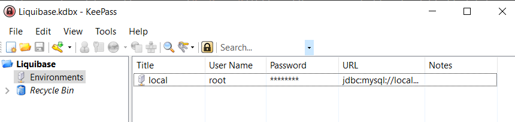

# Liquibase Security PowerShell Module

## Description
This project was developed to eliminate the security issue of having usernames and passwords in a liquibase properties file. This problem is fixed by setting up a [KeePass 2](https://keepass.info/download.html) database to store the information, then using the commands to tell the module where your KeePass database is and to load username, password, and url from that database into liquibase command environment variables. 
## Setup
- Download KeePass 2
- Setup a new database named Liquibase
   - Set the Authentication Method to "Windows Account"
   - Add an `Environments` Group
   - Add an entry with a title corresponding to each environment. Your url should be the jdbc url that you would use in the liquibase properties file

At this point you should have a database that looks like the following:


*Note* if you use the same base connection information for different databases, replace your database name with `{{liquibase-database}}` in the KeePass entry. Add a line to the bottom of your liquibase.properties file like this:
```bash
liquibase.database=your-database-name
```
- Import the module to your powershell instance (I personally use an import in my profile)
- Your first time setup you'll need to run the following command:
```bash
SetupKeePass C:\path\to\keepass.kdbx
```
## Usage
To switch environments use the `LBSwitchEnvironments` command
```bash
LBSwitchEnvironments local
```
To view what environment you are in, use the `LBGetEnvironment` command

To clear the environment, use the `LBClearEnvironment` command

## Important Notes
- This requires the Database Name to be `Liquibase` and the Entry Group to be named `Environments`. If the KeePass database isn't set up exactly this way, this will not work!
- This will require you to be extra careful in checking which environment you are in
- Your liquibase.properties file should only requires
   - your changelog file
   - your database name